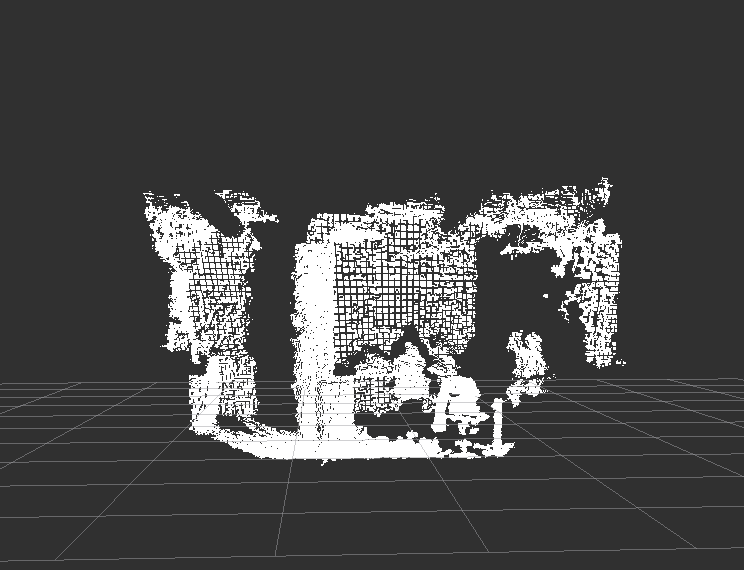
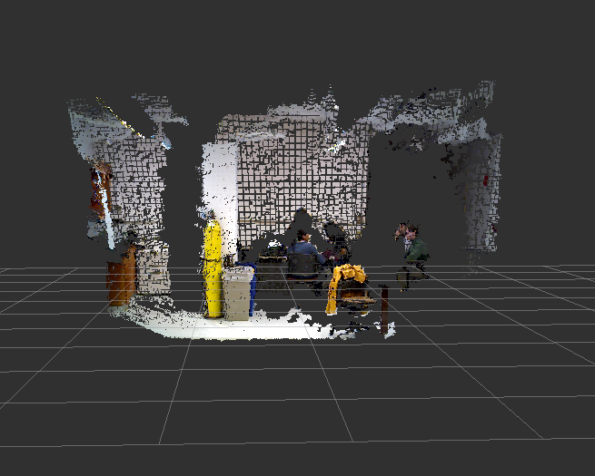
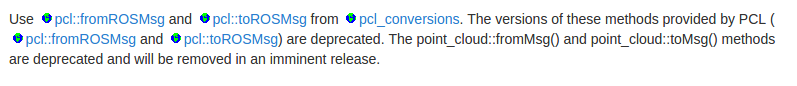
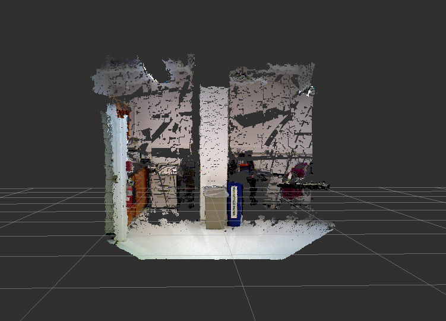
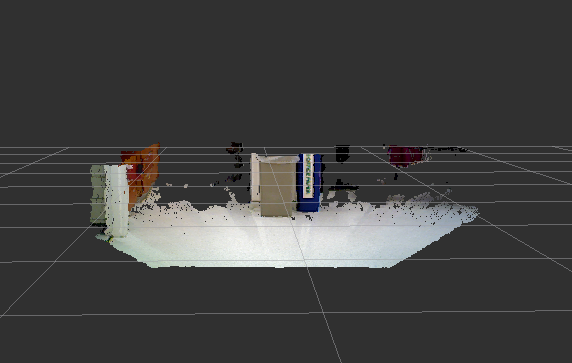
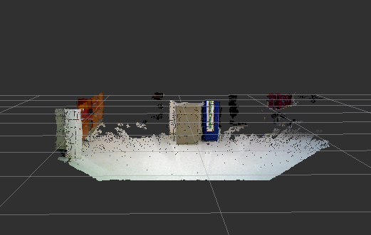
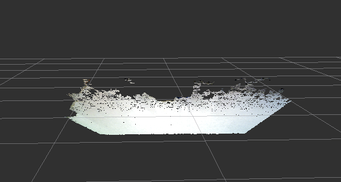
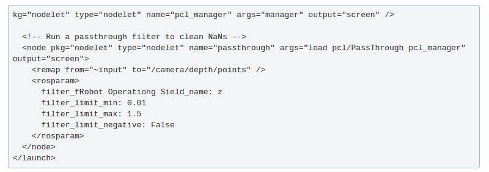
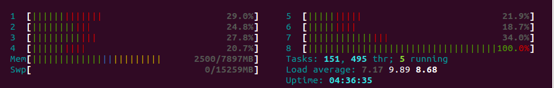
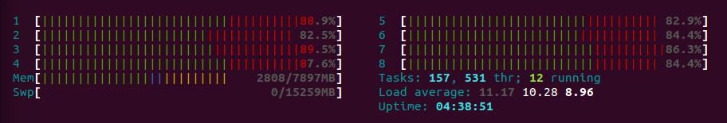

### ME 495 Mini Project 1 - Point Cloud Library, Nodelets, and ROS Indigo
### Team: Alex Broad, Ritwik Ummalaneni, Ji-hoon Kim
### Due Date: November 5, 2014

Project Description
------------------------
Using an RGB-D sensor and the Point Cloud Library, we will separate the ground plane from the rest of the scene. If we complete all of our main project goals, we will implement a version of this that uses nodelets.  If we get a nodelet version of our project running, we will use euclidean clustering to find objects in the scene and potentially calculate cool things like the velocity of a rolling cylinder. 

Project Goals
------------------------
1. Test different RGB-D sensors
2. Test different RGB-D sensor drivers (openni vs openni2)
3. Visualize the point cloud produced by the RGB-D sensors in rviz
4. Using the sensor and the PCL (Point Cloud Library), separate the floor (or any plane parallel to the camera's frame) from the rest of the scene

Additional goals:

1. Implement version of this that uses ROS nodelets 
2. Find objects in scene
  1. Perform additional calculations on an object (like finding the center of the object and tracking it over time)

Testing the Hardware
-----------------------
Choice of Microsoft XBOX 360 Kinect or Asus Xtion PRO LIVE

From our perspective, the main differences between the Microsoft Kinect and the Asus Xtion PRO Live are the size, form factor and power supply.  The Kinect is both larger and needs to plug into an outlet to be powered.  The Asus is smaller and is powered over USB. There are a few other small differences between the two sensors (some can be found [here](http://wiki.ipisoft.com/Depth_Sensors_Comparison) and [here](http://answers.ros.org/question/12900/microsoft-kinect-or-asus-xtion/))

Our experience using each of the two devices is summarized below : 

### Asus Xtion PRO Live

* Plug it into usb port
* run roslaunch openni_launch openni.launch
  * works on Alex's computer, does not work on Ritwik or Ji-hoon's
* run roslaunch openni2_launch openni2.launch 
  * works on everyone's computer
* run rviz
* set global options fixed frame to “camera_link”
* add PointCloud2 topic to rviz
* set PointCloud2 topic to “/camera/depth/points”

### Microsoft Kinect

* Plug it into usb port (and the power cord)
* run roslaunch openni_launch openni.launch 
  * Initially this caused a problem. We we're being told the no device was found.  We are using ROS Indigo and Ubuntu 14.04, but we found [this](http://answers.ros.org/question/60562/ubuntu-12042-and-openni_launch-not-detecting-kinect-after-update/) help page. 
    * And yep, that fixes our problem!  It seems as though the previously installed openni driver has a problem. Running the script from the top rated answer on the afformentioned help page worked and solved our problem
* re-run roslaunch openni_launch openni.launch 
* run rviz
* set global options fixed frame to “camera_link”
* add PointCloud2 topic to rviz
* set PointCloud2 topic to “/camera/depth/points”

Using either sensor, you can see the camera image in a different viewer by running the following command:
```
rosrun image_view image_view image:=/camera/depth/image
```

When you first start up the sensors, the resulting point clouds are not registered.  To register the point clouds you can follow these steps:
* rosrun rqt_reconfigure rqt_reconfigure 
* under the camera tab, click ‘driver’
* on the driver menu, check the box next to ‘depth_registration’
* close rqt_reconfigure
* go back to rviz
* change PointCloud2 topic to '/camera/depth_registered/points’

We tested the Kinect and Xtion simultaneously on two separate computers. It was immediately obvious that there is interference between the two sensors. The Xtion seemed particularly sensitive within any proximity to the Kinect sensor.  According to the above sources, the Xtion sensor should be resiliant to interference with another Xtion sensor, but it is clear that it is susceptible to interference from a Kinect.

Summary of differences between Openni and Openni2 drivers
-----------------------
We recognized that there are differences between which devices work with openni1 and openni2. The way we have it set up so far
* Out of the box, openni1 works with asus on Alex's computer
  * It did not work for Ritwik or Ji-hoon out of the box (they do have the same computer). They had to use openni2 instead, which worked out of the box
* Running the [Avin2](http://answers.ros.org/question/60562/ubuntu-12042-and-openni_launch-not-detecting-kinect-after-update/) fix that is linked above makes openni1 work with the Kinect, but breaks the Asus driver.  We can then uses Jarvis’s [solution](http://answers.ros.org/question/109411/asus-xtion-problems-with-ubuntu-1204-running-ros-fuerte/#109831)  to fix Asus to work with openni1, otherwise we can just use openni2

Installing and setting up the PCL (Point Cloud Library)
-----------------------

>The Point Cloud Library (PCL) is a standalone, large scale, open project for 2D/3D image and point cloud processing. 

[PCL Website](http://pointclouds.org/)

Essentially, this library makes it easy to work with depth data provided by rgb-d sensors.  It represents the depth data as a cloud of points in (x,y,z) space and implements a number of useful algorithms to filter and otherwise process the depth data.  Additionally, it is extra nice because PCL can be used in ROS, with ROS-specific data types.  Less nice is the available documentation.  Development is ongoing and changes often occur quickly and without sufficient documentation. Hopefully this write up will explain some of it more clearly and help you get started using PCL in your ROS application.

**Below is a detailed account of our experience getting PCL set up in ROS.**

For some reason Alex already had it installed on his system but Ritwik did not. If you do not have it installed on your computer, run: 
```
sudo apt-get install ros-indigo-pcl-*
```
This will include ‘pcl-ros’, ‘pcl-msgs’, ‘pcl-conversions’ packages.

When developing our ROS node, we initialized our Package.xml file to depend on: geometry_msgs, roscpp, rospy, std_msgs, sensor_msgs, pcl_ros, pcl_msgs, pcl_conversions

We later found out that pcl_conversions is either mostly or completely depricated.  The main purpose of this package is to convert between ROS specific PCL messages (that can be sent on topics just like standard ROS messages) and the PCL objets.  However PCL is moving towards being able to handle the ros_pcl messages just as if they were PCL objects. We actually ended up converting between the two object types at certain times and not converting at other times. It is our belief that you do not need to convert between the two types if you are using ROS Indigo and the newest version of PCL (1.7).

Back to the task at hand. To get PCL up and running in our ROS application, we started by following the online [tutorial](http://wiki.ros.org/pcl/Tutorials).

The first thing to note, is that the documentation for PCL in Indigo is unavailable, so we decided to follow the Hydro documentation.  We copied the example file.  We gave the node a name, and re-ran catkin_make.  The build succeeded, so the conversion from hydro to indigo seems to have gone smoothly so far!

Our next step was to test some basic functionality.  We wanted to see the example code run so we needed to run 
* roscore
* openni2
* rviz
* our node
all together.  When running this, we needed to remap the output of openni2 to our /input topic. 

You can see the resulting point cloud in the following pictures





After a few trials, the process of running all of these files together was frustrating, so we decided to write a launch file. We created a launch directory and a launch file ‘pcl_project.launch’. The launch file includes ‘openni2’, launches our own node, and launches ‘rviz’. We tested it and it worked.

We then updated our launch file to launch openni2 with the argument, depth_registration=true, which automatically depth registers values in the point cloud as we explained earlier.  We also changed our launch file to launch rviz node with argument=”-d $(find our_package)/viz.rviz” which is the config file we set up to show the point cloud how we want.

The next step was trying to get some example filter code to work using the PCL. **This was difficult.** The PCL/ROS documentation is lacking in many ways and examples online are conceptually all over the place.  PCL and ROS are developed separately and both are still undergoing many changes, a fact that is only compounded when trying to use them together.  Many of the examples that you can find online are from previous versions of one or both.  Additionally, the PCL documentation is especially poor.  The codebase is written in C++ but does not follow a single standard when it comes to method signature and what types of objects are expected.  For instance, there seem to be a number of different pointer definitions, such as pcl::PointCloud<pcl::PointCloudXYZRGB>::Ptr vs boost::make_shared<pcl::PointCloud<pcl::PointXYZRGB>  > and even sensor_msgs::PointCloud2Ptr.  The last example is obviously from different packages but there seems to be a lot of overloaded terminology that makes knowing when to use one versus the other very difficult. The boost::make_shared<pcl::PointCloud<pcl::PointXYZRGB>  > was especially tough to figure out as it was not in any of the example code we found on the web.   Matt Derry was able to help out by sharing some of his code which had solved this problem and adding the boost::make_shared to the setInputCloud method fixed all of our problems in the different sensors. People have also developed [python bindings](https://github.com/strawlab/python-pcl) for PCL, but these are only limited to a few PCL modules and hence we do not consider using these. 

As mentioned before, there was previously a necessary step to convert between ROS sensor message point clouds and PCL point clouds.  As to whether or not they are necessary any more, or which version to use, is very confusing if you read the documentation.  The following image is the documentation relating to the PCL conversion process.



Regardless, we were finally able to some example code to work.  After we were able to get the first example to work, we were able to quickly get some filters to work.  The first step in this process was the shrink the Point Cloud we were going to work on.  The Point Cloud objects are very large and can run at up to 30 hz.  As our goal (separating the floor from the rest of the scene) does not involve a large section of the point cloud, we can remove many of the points.

During our first implementation, we set up the following filters:
* pass through filter in the x dimension
* pass through filter in the y dimension
* pass through filter in the z dimension

Note: We later found out that using a single cropbox filter accomplishes the same effect as 3 passthrough filters.

The following image is our point cloud after it has gone through a pass through filter in the X dimension.



The next image is the point cloud after it has gone through a pass through filter in all 3 dimensions.



This reduced the number of points by restricting the area in which we are performing our computations.  However, we can do even more downsampling by reducing the number of points per area.  We did this by implementing a Voxel Grid Filter.



Lastly, to separate the floor from the rest of the scene we used a RANSAC algorithm.  The resulting point cloud can be seen in the following image:



Once we had the RANSAC algorithm up and running, it was clear that it was eating up a lot of processing power. By implementing the 3 pass through filters, we saw a large speed up.  This also took us to the first additional aspect of our assignment, nodelets.

Nodelets
-----------------------
According to the nodelet package summary on the ROS wiki:
> The nodelet package is designed to provide a way to run multiple algorithms in the same proces with zero copy transport between algorithms

Taking point cloud data and running it through various filters would normally involve having to repeatedly copy data into other places in memory. This copying process takes up both CPU time and power to perform the copy, as well as memory space to hold it. Because copying can be redundant, reducing the number of copies using "zero-copy" operations allows for faster, more efficient processing. Taking advantage of the zero copy optimizations using the nodelet package allows for more frames per second due to reduced CPU processing time.

### Fatal Error in Nodelets Package
**This point is very important.** Trying to use the pcl_ros nodelets out of the box does not work because of a syntax error in the pcl_nodelets.xml file located in /opt/ros/indigo/share/pcl_ros. A 
```
</library>
```
 tag is needed in line 36 of the file. Adding this line should allow the nodelets to work.  A pull request to fix this bug has already been submitted by another user and the change was merged in c6a31b62e, so cloning the indigo-devel branch of pcl_ros into the workspace and running catkin_make should also solve this problem.

### Documentation Issues
We also ran into some more poor documentation when trying to get nodelets to work, which is unfortunate because they are actually pretty easy to use.  To get our first nodelet up and running, we tried to follow the Pass Through filter [tutorial](http://wiki.ros.org/pcl_ros/Tutorials/PassThrough%20filtering).

Seriously, look at the following image.



You'll notice, they didn’t copy the whole launch file so the code starts off at kg=”nodelet”.  Additionally they have copied some other incorrect syntax and didn’t check it before uploading it. Look at the field name ‘filter_fRobot Operationg Sield_name: z’. It should be filter_field_name, but they have somehow copied ROS into the middle of it. These are not huge bugs and not difficult to recognize or fix, but it's a good illustration of the type of error that goes into this documentation.

In addition, only a few of the nodelets were listed in the wiki. The pcl_ros package actually contains many more filters and features. Since this project took advantage of the filters in pcl_ros, we'll briefly describe each of the available filters here.

###PCL Filter Nodelets
Passthrough - This filter takes a particular field and an interval for that field to consider. For instance, you could filter out all the points in a point cloud outside a particular range of x coordinates. You could also filter out all the points within a given range.

Voxel Grid - Subdivides the point cloud into lots of small chunks called "leaves" and averages the points in the leaf into a single point. The result is a downsampled cloud point, which could be much faster to process than a higher resolution point cloud.

Project Inliers - This filter is included in the package but has not actually been implemented. For now, it is just an empty nodelet that will not create any new ROS topics.

Extract Indices - Returns a point cloud of the indices of the input point cloud.

Statistical Outlier Removal - Removes or returns points that would be considered outliers. Outliers are considered using the mean_k parameter, which is the number of points to use for mean distance estimation, and stddev, the standard deviation multiplier threshold.

Crop Box - similar to a passthrough filter but filters through a specified 3D box. Can return all points inside or outside the box.

###Performance
Once we got past those few bugs, nodelets were actually very easy to set up.  Each nodelet works by subscribing to one topic and then output the result of the nodelet on another topic.  We considered just making some changes to our code and using nodelets instead of our original implementation, but decided that if we wanted to test the relative speed of both approaches we should make separate executables that we can test.  So we made a new ros node ‘pcl_node_w_nodelets.cpp’ to test.  We then did some speed tests, the results are below:

(As a side note, because the original implementation without nodlets used 3 passthrough filters and a voxel grid filter, the nodelets implementation also use 3 passthrough filter nodelets and a voxel grid nodelet. We could have used a single crop box filter nodelet instead of 3 passthrough filters but we stuck with the passthrough nodelets for fair comparison.)

**Without Nodelets:**

| average rate | min | max | std dev |
|--------------|:----|:----|:--------|
| 12.293       |0.076s | 0.092s | 0.00462s |
| 12.174       |0.074s | 0.093s | 0.00457s |
| 12.258       |0.074s | 0.093s | 0.00454s |
| 12.319       |0.073s | 0.093s | 0.00452s |
| 12.092       |0.076s | 0.093s | 0.00459s |
| 12.318       |0.073s | 0.093s | 0.00434s |

**With Nodelets:**

| average rate | min | max | std dev |
|--------------|:----|:----|:--------|
| 16.795       |0.042s | 0.094s | 0.01398s |
| 16.123       |0.042s | 0.094s | 0.01416s |
| 15.818       |0.033s | 0.112s | 0.01777s |
| 15.647       |0.033s | 0.112s | 0.01782s |
| 15.758       |0.033s | 0.112s | 0.01812s |


So the difference is that we see an increase in publish rate by using nodelets. We can also see the difference in processing load by running top.

**Without Nodelets:**


**With Nodelets:**


From these results we can see the result of the parallelization of our code using the nodelets. We are clearly using more processing power, but it is on more than one core and results in higher publishing frequency without actually consuming any more memory.
